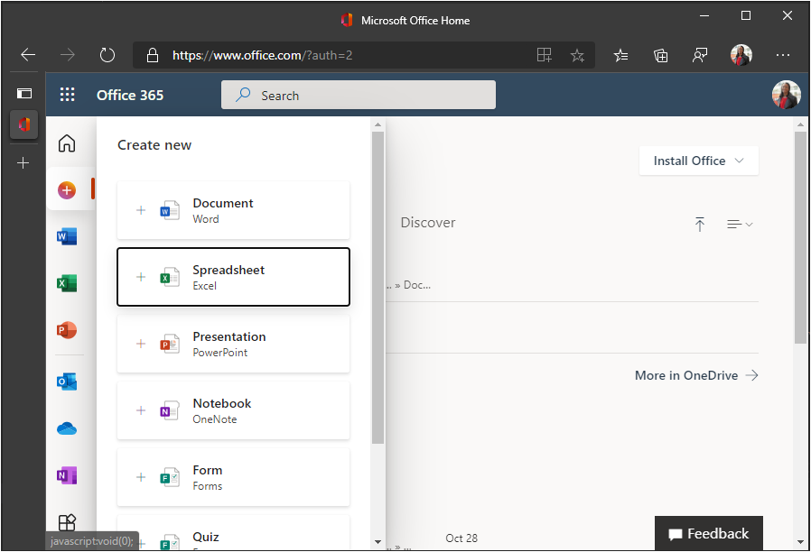
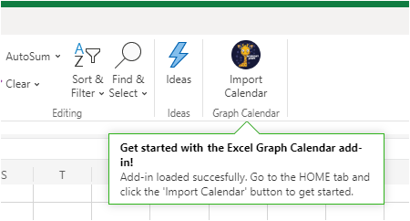
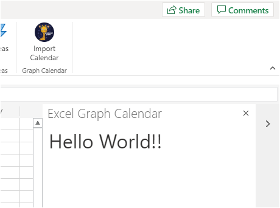

<!-- markdownlint-disable MD002 MD041 -->

In this exercise you will create an Office Add-in solution using [Express](http://expressjs.com/). The solution will consist of two parts.

- The add-in, implemented as static HTML and JavaScript files.
- A Node.js/Express server that serves the add-in and implements a web API to retrieve data for the add-in.

## Create the server

1. Open your command-line interface (CLI), navigate to a directory where you want to create your project, and run the following command to generate a package.json file.

    ```Shell
    yarn init
    ```

    Enter values for the prompts as appropriate. If you're unsure, the default values are fine.

1. Run the following commands to install dependencies.

    ```Shell
    yarn add express@4.17.1 express-promise-router@4.1.0 dotenv@10.0.0 node-fetch@2.6.1 jsonwebtoken@8.5.1@
    yarn add jwks-rsa@2.0.3 @azure/msal-node@1.2.0 @microsoft/microsoft-graph-client@3.0.0-Preview.2
    yarn add date-fns@2.22.1 date-fns-tz@1.1.4 isomorphic-fetch@3.0.0 windows-iana@5.0.2
    yarn add -D typescript@4.3.5 ts-node@10.0.0 nodemon@2.0.9 @types/node@14.17.4 @types/express@4.17.12
    yarn add -D @types/node-fetch@2.5.10 @types/jsonwebtoken@8.5.3 @types/microsoft-graph@1.41.0
    yarn add -D @types/office-js@1.0.188 @types/jquery@3.5.5 @types/isomorphic-fetch@0.0.35
    ```

1. Run the following command to generate a tsconfig.json file.

    ```Shell
    tsc --init
    ```

1. Open **./tsconfig.json** in a text editor and make the following changes.

    - Change the `target` value to `es6`.
    - Uncomment the `outDir` value and set it to `./dist`.
    - Uncomment the `rootDir` value and set it to `./src`.

1. Open **./package.json** and add the following property to the JSON.

    ```json
    "scripts": {
      "start": "nodemon ./src/server.ts",
      "build": "tsc --project ./"
    },
    ```

1. Run the following command to generate and install development certificates for your add-in.

    ```Shell
    npx office-addin-dev-certs install
    ```

    If prompted for confirmation, confirm the actions. Once the command completes, you will see output similar to the following.

    ```Shell
    You now have trusted access to https://localhost.
    Certificate: <path>\localhost.crt
    Key: <path>\localhost.key
    ```

1. Create a new file named **.env** in the root of your project and add the following code.

    :::code language="ini" source="../demo/graph-tutorial/example.env":::

    Replace `PATH_TO_LOCALHOST.CRT` with the path to localhost.crt and `PATH_TO_LOCALHOST.KEY` with the path to localhost.key output by the previous command.

1. Create a new directory in the root of your project named **src**.

1. Create two directories in the **./src** directory: **addin** and **api**.

1. Create a new file named **auth.ts** in the **./src/api** directory and add the following code.

    ```typescript
    import Router from 'express-promise-router';

    const authRouter = Router();

    // TODO: Implement this router

    export default authRouter;
    ```

1. Create a new file named **graph.ts** in the **./src/api** directory and add the following code.

    ```typescript
    import Router from 'express-promise-router';

    const graphRouter = Router();

    // TODO: Implement this router

    export default graphRouter;
    ```

1. Create a new file named **server.ts** in the **./src** directory and add the following code.

    :::code language="typescript" source="../demo/graph-tutorial/src/server.ts" id="ServerSnippet":::

## Create the add-in

1. Create a new file named **taskpane.html** in the **./src/addin** directory and add the following code.

    :::code language="html" source="../demo/graph-tutorial/src/addin/taskpane.html" id="TaskPaneHtmlSnippet":::

1. Create a new file named **taskpane.css** in the **./src/addin** directory and add the following code.

    :::code language="css" source="../demo/graph-tutorial/src/addin/taskpane.css":::

1. Create a new file named **taskpane.js** in the **./src/addin** directory and add the following code.

    ```javascript
    // TEMPORARY CODE TO VERIFY ADD-IN LOADS
    'use strict';

    Office.onReady(info => {
      if (info.host === Office.HostType.Excel) {
        $(function() {
          $('p').text('Hello World!!');
        });
      }
    });
    ```

1. Create a new directory in the **.src/addin** directory named **assets**.

1. Add three PNG files in this directory according to the following table.

    | File name   | Size in pixels |
    |-------------|----------------|
    | icon-80.png | 80x80          |
    | icon-32.png | 32x32          |
    | icon-16.png | 16x16          |

    > [!NOTE]
    > You can use any image you want for this step. You can also download the images used in this sample directly from [GitHub](https://github.com/microsoftgraph/msgraph-training-office-addin/demo/graph-tutorial/src/addin/assets).

1. Create a new directory in the root of the project named **manifest**.

1. Create a new file named **manifest.xml** in the **./manifest** folder and add the following code. Replace `NEW_GUID_HERE` with a new GUID, like `b4fa03b8-1eb6-4e8b-a380-e0476be9e019`.

    :::code language="xml" source="../demo/graph-tutorial/manifest/manifest.xml":::

## Side-load the add-in in Excel

1. Start the server by running the following command.

    ```Shell
    yarn start
    ```

1. Open your browser and browse to `https://localhost:3000/taskpane.html`. You should see a `Not loaded` message.

1. In your browser, go to [Office.com](https://www.office.com/) and sign in. Select **Create** in the left-hand toolbar, then select **Spreadsheet**.

    

1. Select the **Insert** tab, then select **Office Add-ins**.

1. Select **Upload My Add-in**, then select **Browse**. Upload your **./manifest/manifest.xml** file.

1. Select the **Import Calendar** button on the **Home** tab to open the taskpane.

    

1. After the taskpane opens, you should see a `Hello World!` message.

    
