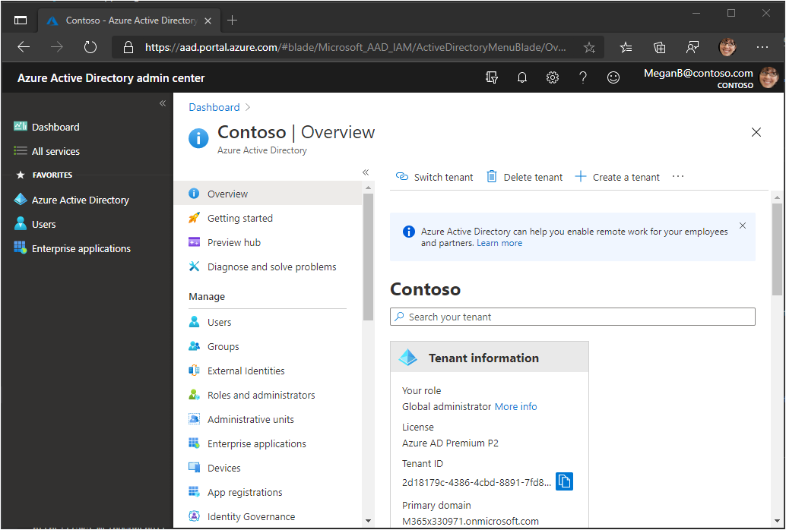
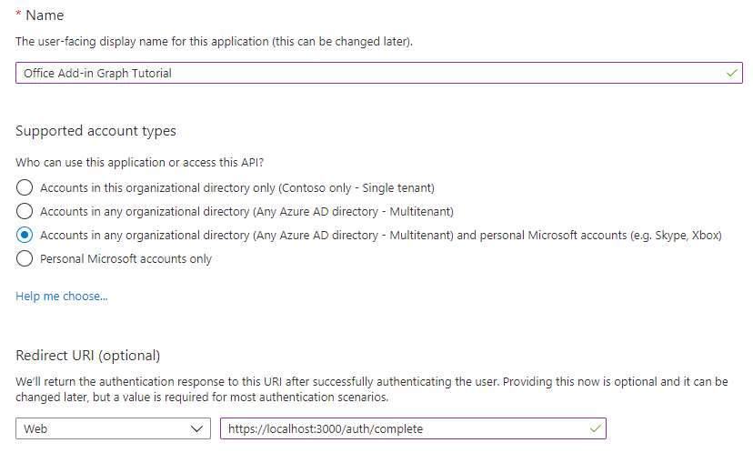
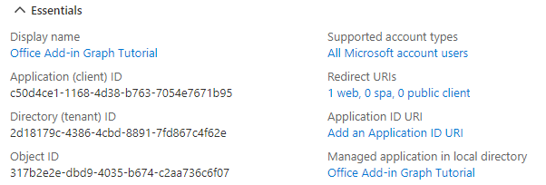
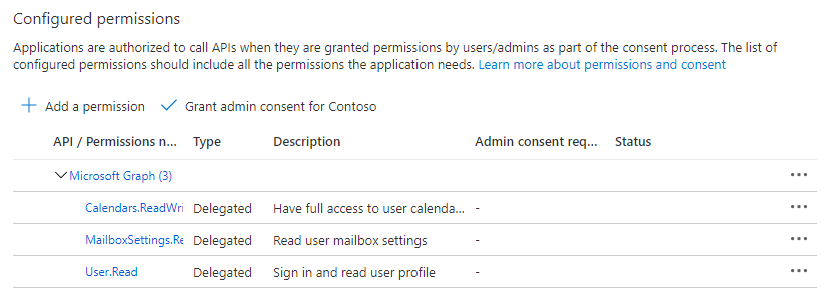
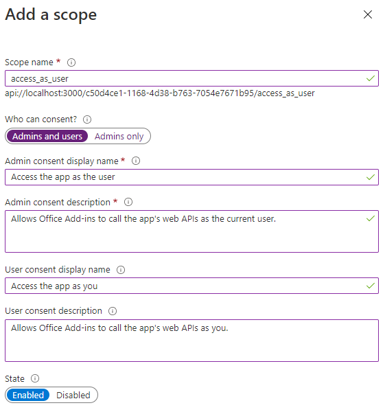

<!-- markdownlint-disable MD002 MD041 -->

In this exercise, you will create a new Azure AD web application registration using the Azure Active Directory admin center.

1. Open a browser and navigate to the [Azure Active Directory admin center](https://aad.portal.azure.com). Login using a **personal account** (aka: Microsoft Account) or **Work or School Account**.

1. Select **Azure Active Directory** in the left-hand navigation, then select **App registrations** under **Manage**.

    

1. Select **New registration**. On the **Register an application** page, set the values as follows.

    - Set **Name** to `Office Add-in Graph Tutorial`.
    - Set **Supported account types** to **Accounts in any organizational directory and personal Microsoft accounts**.
    - Under **Redirect URI**, set the first drop-down to `Single-page application (SPA)` and set the value to `https://localhost:3000/consent.html`.

    

1. Select **Register**. On the **Office Add-in Graph Tutorial** page, copy the value of the **Application (client) ID** and **Directory (tenant) ID** and save them, you will need them in the next step.

    

1. Select **Certificates & secrets** under **Manage**. Select the **New client secret** button. Enter a value in **Description** and select one of the options for **Expires** and select **Add**.

1. Copy the client secret value before you leave this page. You will need it in the next step.

    > [!IMPORTANT]
    > This client secret is never shown again, so make sure you copy it now.

1. Select **API permissions** under **Manage**, then select **Add a permission**.

1. Select **Microsoft Graph**, then **Delegated permissions**.

1. Select the following permissions, then select **Add permissions**.

    - **Calendars.ReadWrite** - this will allow the app to read and write to the user's calendar.
    - **MailboxSettings.Read** - this will allow the app to get the user's time zone from their mailbox settings.

    

## Configure Office Add-in single sign-on

In this section you'll update the app registration to support [Office Add-in single sign-on (SSO)](https://docs.microsoft.com/office/dev/add-ins/develop/sso-in-office-add-ins).

1. Select **Expose an API**. In the **Scopes defined by this API** section, select **Add a scope**. When prompted to set an **Application ID URI**, set the value to `api://localhost:3000/YOUR_APP_ID_HERE`, replacing `YOUR_APP_ID_HERE` with the application ID. Choose **Save and continue**.

1. Fill in the fields as follows and select **Add scope**.

    - **Scope name:** `access_as_user`
    - **Who can consent?: Admins and users**
    - **Admin consent display name:** `Access the app as the user`
    - **Admin consent description:** `Allows Office Add-ins to call the app's web APIs as the current user.`
    - **User consent display name:** `Access the app as you`
    - **User consent description:** `Allows Office Add-ins to call the app's web APIs as you.`
    - **State: Enabled**

    

1. In the **Authorized client applications** section, select **Add a client application**. Enter a client ID from the following list, enable the scope under **Authorized scopes**, and select **Add application**. Repeat this process for each of the client IDs in the list.

    - `d3590ed6-52b3-4102-aeff-aad2292ab01c` (Microsoft Office)
    - `ea5a67f6-b6f3-4338-b240-c655ddc3cc8e` (Microsoft Office)
    - `57fb890c-0dab-4253-a5e0-7188c88b2bb4` (Office on the web)
    - `08e18876-6177-487e-b8b5-cf950c1e598c` (Office on the web)
