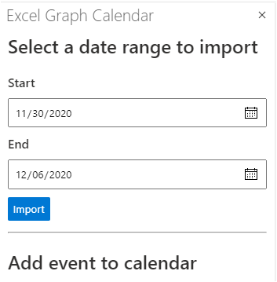
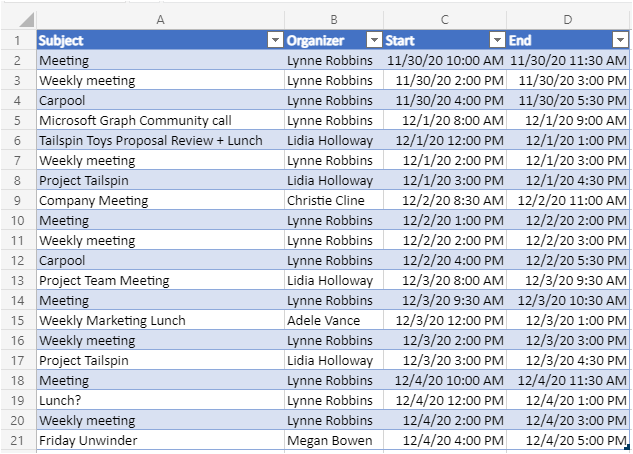

<!-- markdownlint-disable MD002 MD041 -->

In this exercise you will incorporate Microsoft Graph into the application. For this application, you will use the [microsoft-graph-client](https://github.com/microsoftgraph/msgraph-sdk-javascript) library to make calls to Microsoft Graph.

## Get calendar events from Outlook

Start by adding an API to get a [calendar view](https://docs.microsoft.com/graph/api/user-list-calendarview) from the user's calendar.

1. Open **./src/api/graph.ts** and add the following `import` statements to the top of the file.

    ```typescript
    import { zonedTimeToUtc } from 'date-fns-tz';
    import { findOneIana } from 'windows-iana';
    import * as graph from '@microsoft/microsoft-graph-client';
    import { Event, MailboxSettings } from 'microsoft-graph';
    import 'isomorphic-fetch';
    import { getTokenOnBehalfOf } from './auth';
    ```

1. Add the following function to initialize the Microsoft Graph SDK and return a **Client**.

    :::code language="typescript" source="../demo/graph-tutorial/src/api/graph.ts" id="GetClientSnippet":::

1. Add the following function to get the user's time zone from their mailbox settings, and to convert that value to an IANA time zone identifier.

    :::code language="typescript" source="../demo/graph-tutorial/src/api/graph.ts" id="GetTimeZonesSnippet":::

1. Add the following function (below the `const graphRouter = Router();` line) to implement an API endpoint (`GET /graph/calendarview`).

    :::code language="typescript" source="../demo/graph-tutorial/src/api/graph.ts" id="GetCalendarViewSnippet":::

    Consider what this code does.

    - It gets the user's time zone and uses that to convert the start and end of the requested calendar view into UTC values.
    - It does a `GET` to the `/me/calendarview` Graph API endpoint.
        - It uses the `header` function to set the `Prefer: outlook.timezone` header, causing the start and end times of the returned events to be adjusted to the user's time zone.
        - It uses the `query` function to add the `startDateTime` and `endDateTime` parameters, setting the start and end of the calendar view.
        - It uses the `select` function to request only the fields used by the add-in.
        - It uses the `orderby` function to sort the results by the start time.
        - It uses the `top` function to limit the results in a single request to 25.
    - It uses a **PageIteratorCallback** object to [iterate through the results](https://docs.microsoft.com/graph/sdks/paging) and to make additional requests if more pages of results are available.

## Update the UI

Now let's update the task pane to allow the user to specify a start and end date for the calendar view.

1. Open **./src/addin/taskpane.js** and replace the existing `showMainUi` function with the following.

    :::code language="javascript" source="../demo/graph-tutorial/src/addin/taskpane.js" id="MainUiSnippet":::

    This code adds a simple form so the user can specify a start and end date. It also implements a second form for creating a new event. That form doesn't do anything for now, you'll implement that feature in the next section.

1. Add the following code to the file to create a table in the active worksheet containing the events retrieved from the calendar view.

    :::code language="javascript" source="../demo/graph-tutorial/src/addin/taskpane.js" id="WriteToSheetSnippet":::

1. Add the following function to call the calendar view API.

    :::code language="javascript" source="../demo/graph-tutorial/src/addin/taskpane.js" id="GetCalendarSnippet":::

1. Save all of your changes, restart the server, and refresh the task pane in Excel (close any open task panes and re-open).

    

1. Choose start and end dates and choose **Import**.

    
